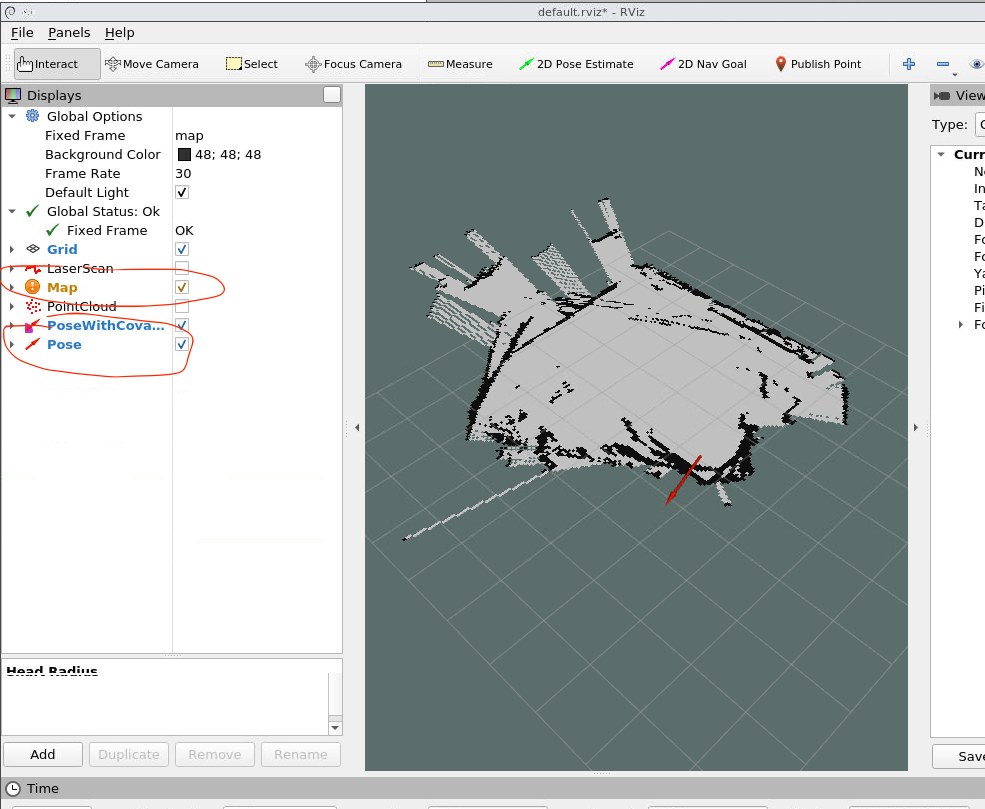

# Scan data in Rviz

1. Run the project on ajboticar and confirm the /scan topic is available
2. Run `rosrun rviz rviz`
3. Open your browser to `localhost:8080/vnc.html` and click connect.
4. In RViz, click the "[Add](./images/rviz_add.png)" button and select "[By topic](./images/rviz_add_topic.png)"
5. View the data on the Rviz window after selecting the topics and datapoints for viewing

